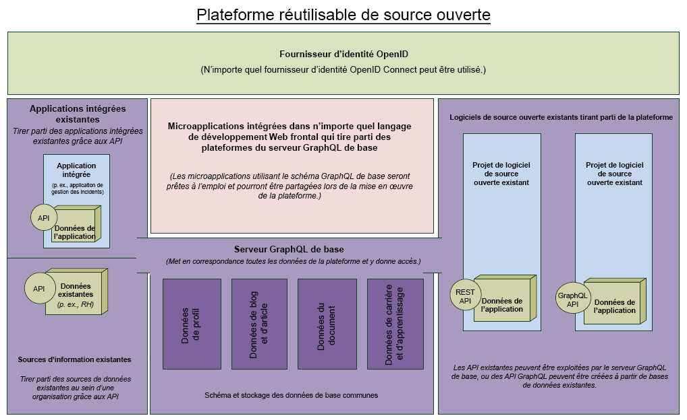

<helmet>
<title> Architecture - Introduction </title>
</helmet>

## Architecture

L’architecture quantique est construite autour de GraphQL (Prisma et Apollo), une file d’attente de message et d’ElasticSearch. Ces composants de base fournissent les services de base qui habilitent toutes les applications dans l’Espace de travail numérique ouvert et accessible.

Le concept directeur de cette architecture est que toute application pourrait faire partie de l’Espace de travail numérique ouvert et accessible même si elle n’est pas conçue expressément pour cette l’architecture. De nombreux niveaux d’intégration différents sont possibles, le niveau d’intégration augmentant exponentiellement avec le nombre d’API disponibles pour l’application.

L’image ci-dessous a été créée dès le début de la construction de cette architecture, mais elle illustre tout de même l’esprit de ce qui est réalisé à l’aide de cette solution. 

