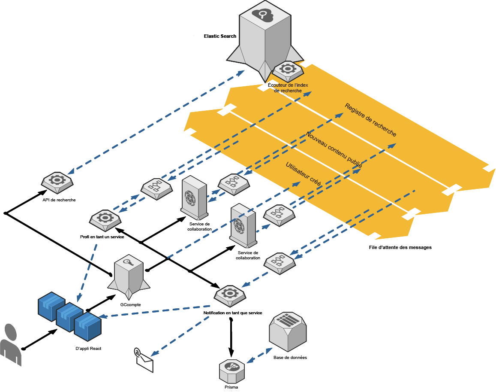

<helmet>
<title> Architecture - Architecture du système </title>
</helmet>

## Architecture du système

L’architecture quantique repose sur des microservices fondamentaux, une file d’attente de messages fondée sur les événements et un fournisseur d’authentification fondé sur la norme JSON Web Token.

Microservices fondamentaux :
* [Profile as a service](/profile/introduction)
* [Notification as a Service]()
* [Search as a Service]()

Les services de collaboration dans l’image ci-dessous représentent des services qui ne sont pas fondamentaux, mais qui sont intégrés dans l’architecture quantique (p. ex., Carrefour de carrière et Discussions).

La file d’attente des messages permet de gérer les événements tels que les publications et les abonnements pour tous les services connectés. Une application n’a pas besoin de se connecter à une interface de protocole d’application (API) distincte pour chaque service, mais simplement de publier un message global à un événement. Tous les services d’écoute abonnés à cet événement recevront alors une copie de l’information à traiter.

Les applications React ci-dessous sont les applications à une seule page qui offrent une fenêtre visuelle sur les possibilités offertes par l’architecture quantique. Les possibilités offertes par l’architecture quantique sont illimitées, qu’il s’agisse de la création d’applications simples comme l’application Annuaire, qui mettent l’accent sur une composante informationnelle clé, ou le Carrefour de carrière, qui peut avoir une orientation plus large et des interactions plus complexes. Comme l’utilisateur contrôle entièrement et en tout temps les données auxquelles une application peut accéder, il peut s’assurer que l’information est protégée. 

